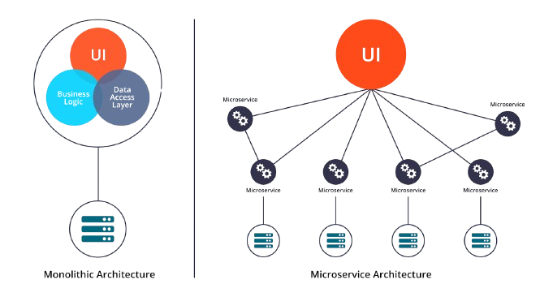
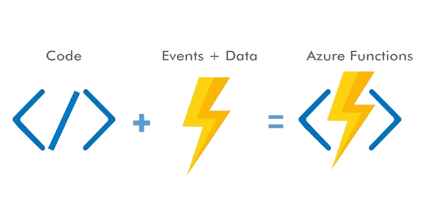

# Les acrhitectures applicatives

- [Les acrhitectures applicatives](#les-acrhitectures-applicatives)
  - [A propos](#a-propos)
  - [Contenu](#contenu)
  - [Formateur](#formateur)

## A propos

Ce dépôt contient du matériel de soutien pour le cours **Architectures Applicatives**

## Contenu

Ce dépôt est organisé comme suit :

- Vous pouvez trouver les présentations PDF du cours ci-dessous:
- [Part 1](./Architectures%20Applicatives%20(Part.%201).pdf)
- [Part 2](./Architectures%20Applicatives%20(Part.%202).pdf)
- [Les exercices](./exercices/)

## Formateur

Nehemie Balukidi, [@olfredos6](https://github.com/Olfredos6)
